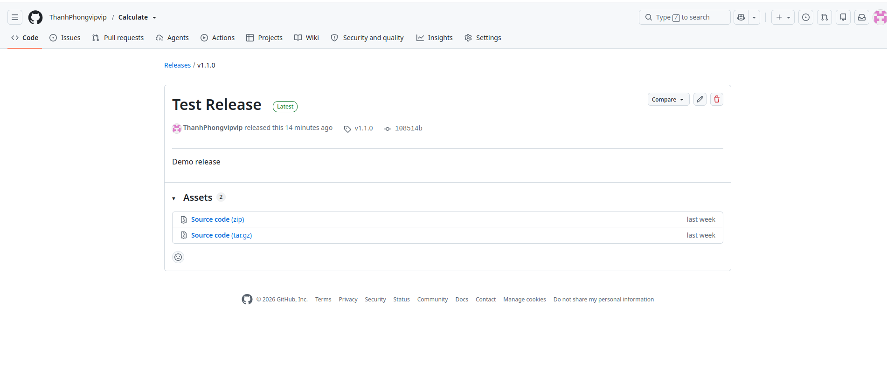

# Git Release:

## Mục đích: 
- Chia sẻ đóng gói ứng dụng, cùng các ghi chú phát hành và các link tới file tài liệu cho người khác có thể sử dụng
- Release dựa trên Git tag, đánh dấu 1 điểm cụ thể ở lịch sử repository. Các release được sắp xếp theo thời gian chúng được tạo trên github

## Các bước tạo release:

### Cách 1: Làm trên web:

#### 1. Tạo tag

- Trong màn hình của repository trên Gitgub, chọn Create a new release 

- Màn hình tạo tag sẽ hiển thị -> chọn tag -> điền tên tag mới (Ví dụ v1.2.0) -> ấn create new tag…

- Chọn nhánh để tạo tag

- Tiếp tục điền các thông tin về tên của Release và thông tin chi tiết cho Release -> Ấn Publish release để tạo Release và Tag mới



#### 2. Cập nhật Local repository với tag được tạo

- Mở terminal và truy cập tới repository và thực hiện lệnh fetch và tag để kéo về và kiểm tra danh sách tag có trong repository.

```bash 
cd ...
git fetch
git tag
```

- Xóa tag gắn trên release

Còn với tag gắn trên Release, chúng ta sẽ cần xóa Release sử dụng tag này. Với tag v1.2.0, chọn vào tag này trong màn hình danh sách tag -> Ấn vào nút có biểu tượng xóa -> Xác nhận xóa

#### Cách 2: Thực hiện qua Github CLI (gh)

- Cài đặt github cli qua apt

```bash
(type -p wget >/dev/null || sudo apt update && sudo apt install wget -y) \
&& sudo mkdir -p -m 755 /etc/apt/keyrings \
&& wget -qO- https://github.com | sudo tee /etc/apt/keyrings/githubcli-archive-keyring.gpg > /dev/null \
&& sudo chmod go+r /etc/apt/keyrings/githubcli-archive-keyring.gpg \
&& echo "deb [arch=$(dpkg --print-architecture) signed-by=/etc/apt/keyrings/githubcli-archive-keyring.gpg] https://github.com stable main" | sudo tee /etc/apt/sources.list.d/github-cli.list > /dev/null \
&& sudo apt update \
&& sudo apt install gh -y
```

- Login
```bash
gh auth login
```
- Tạo release:
```bash
gh release create v1.0.0 --title "Release v1.0.0" --notes "Mô tả nội dung bản phát hành"
```

# Github Packages
- GitHub Packages là một dịch vụ lưu trữ gói phần mềm cho phép bạn lưu trữ các gói phần mềm của mình ở chế độ riêng tư hoặc công khai, tương tự 
    - npm → JavaScript/Node.js
    - Maven Central → Java
    - PyPI → Python
    - Docker Hub → Docker image
    - NuGet → .NET

- GitHub Repository chứa source code, còn GitHub Packages chứa artifact/package đã build/đóng gói.
Ví dụ:
```bash
Calculate
   │
   ├── Code
   ├── Tag
   ├── Release
   └── Package
```
Repository: nơi chứa code
```bash
Calculate/
├── src/
├── README.md
└── package.json
```

sau đó :
```bash
git push origin main
```

-> Code sẽ được đưa lên Github Repository

Package: Người khác có thể cài vào Project

Ví dụ khi viết 1 thư viện: `Subtract`

Sau khi đóng gói nó thành: `Subtract@1.1` và upload lên Github Packages.

Project có thể  tải package Subtract về và sử dụng:

```bash
npm install @ThanhPhongvipvip/Subtract
```

# Github Project

- DÙng để quản lý xông việc của project

Ví dụ:

```bash
DisplayInfo
│
├── Code             ← source code
├── Issues           ← các việc/bug
├── Pull requests    ← review code
└── Projects         ← quản lý công việc
```

Ví dụ đang làm app ABC:

| Công Việc| Trạng thái|  
| :--- | :---: |
| GUI| DOne|  
| Làm chức năng A| In process|  
| Fix bug abc| To do|  
| Unit test| To do|  

Tạo 1 Project để kéo các Issue vào và quản lý chúng theo kiểu bảng Kanban:
| TO DO | In Process | DONE |
| :--- | :---: | ---: |
|Fix abc|Implement UI|Setup project|
|Writest|API connection|Database|
|Fix display|||


## Nó liên quan đến Issue:

Ví dụ: Tạo issue:

```bash
#12 Fix Display
```

Sau đó đưa Issue #12 vào Project

Project sẽ theo dõi:

```bash
Issue #12
   ↓
Todo
   ↓
In Progress
   ↓
Done
```

Code vẫn nằm trong Repository, còn Project giúp quản lý những việc càn làm