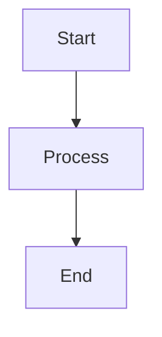

# Writing mathematical expressions 

| Ký hiệu | Cách viết |
|:--|:--|
|$\to$|\to |
|$\infty$|\infty|
|$k_{n+1}$|k_{n+1}|
|$n^2$|n^2|
|$k_n^2$|k_n^2|
|$\frac{n!}{k!(n-k)!}$|\frac{n!}{k!(n-k)!}|
|$\binom{n}{k}$|\binom{n}{k}|
|$\frac{\frac{x}{a}}{x-a}$|\frac{\frac{x}{a}}{x-a}|
|$^3/_7$|^3/_7|
|$\sqrt{k}$|\sqrt{k}|
|$\sqrt[n]{k}$|\sqrt[n]{k}|
|$\sum_{i=1}^{10} t_i$|\sum_{i=1}^{10} t_i|
|$\int_0^\infty \mathrm{e}^{-x}\,\mathrm{d}x$|\int_0^\infty \mathrm{e}^{-x}\,\mathrm{d}x|
|$\sum$|\sum|
|$\prod$|\prod|
|$\alpha$|\alpha|
|$\beta$|\beta|
|$\gamma$|\gamma|
|$\Gamma$|\Gamma|
|$\pi$|\pi|
|$\Pi$|\Pi|
|$\phi$|\phi|
|$\Phi$|\Phi|
|$\varphi$|\varphi|
|$\theta$|\theta|
|$\hat{a}$ (Ước lượng)|\hat{a}|
|$\begin{bmatrix} 1 & 2 & 3 \\ 4 & 5 & 6 \\ 7 & 8 & 9 \end{bmatrix}$   |\begin{bmatrix} 1 & 2 & 3 \\ 4 & 5 & 6 \\ 7 & 8 & 9 \end{bmatrix}|
|$\arg\min_{x} f(x)$|\arg\min_{x} f(x)|
|$\Rightarrow$|\Rightarrow|
|$\Leftrightarrow$|\Leftrightarrow|
|$\le$|\le|
|$\geq$|\geq|
|$\neq$|\neq|
|$\approx$|\approx|
|$\in$|\in|
|$\notin$|\notin|
|$\subset$|\subset|
|$\cap$ $\cup$|\cap \cup|
|$\forall$|\forall|
|$\exists$|\exists|

### * Note: Trong ký hiệu toán học, các chỉ số  chạy tham số dưới sẽ nằm sau dấu _, các chỉ số ở phía trên sẽ nằm sau dấu ^/, các nhóm cùng vị trí nằm trong {}

